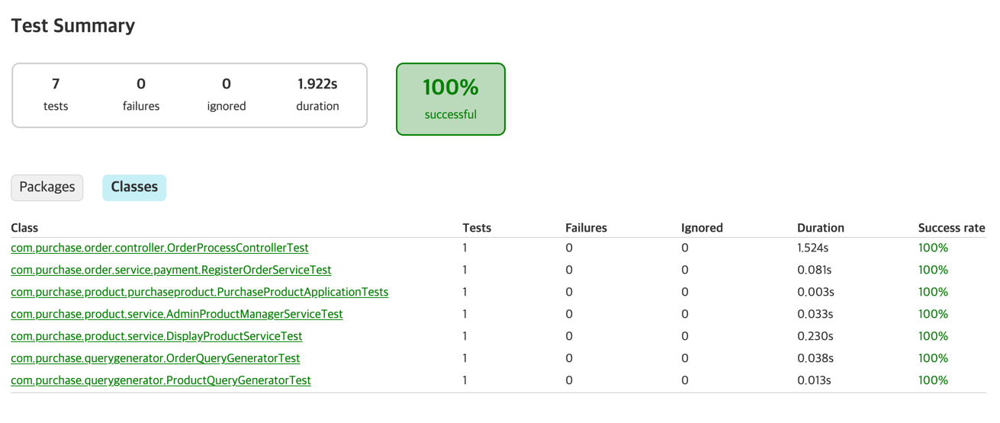

### 상품구매 서비스

#### API 사용법
0. Active Profile 이 Local 로 세팅이 되어 있으므로 인텔리제이 또는 이클립스 등에서 Active.profile 을 local 로 설정하여 구동하여야 합니다.
1. Springboot 프로젝트를 빌드하여 jar 파일을 만들어 실행하거나 인텔리제이 등을 이용하여 jar 를 실행합니다.
2. 8088 포트로 접속이 가능 합니다. (http://localhost:8089/swagger-ui.html)
3. Swagger 문서에 각 URI 에 대한 설명을 참고하여 상품구매 테스트 진행이 가능 합니다.

#### 패키지 구성
- category
    - 상품카테고리에 대한 상품도메인에 대한 엔터티, 리포지토리(데이터영속성 계층) 을 제공합니다.
- config
    - API 보안 과  API 문서설정에 대한 환경구성을 정의 합니다.
- member
    - 회원로그인요청과 회원도메인에 대한 엔터티, 리포지토리와 서비스(유즈케이스)를 제공합니다.
- order
    - 상품주문에 대한 각종 요청과 도메인에 대한 엔터티, 리포지토리, 외부통신과의 응답스킴, 서비스(유즈케이스)를 제공합니다.
- product
    - 상품에 대한 요청과 각종 요청과 도메인에 대한 엔터티, 클라이언트(외부사용자)에 제공되는 읽기전용모델스킴, 서비스(유즈케이스)를 제공합니다.
- querygenerator
    - 여러 도메인 엔터티를 복합적으로 관계를 맺어 데이터를 질의하여 결과를 제공하기 위한 요청과
    이에 대한 쿼리질의용 서비스를 제공합니다.

#### 인메모리 H2 DB 정보
http://localhost:8089/h2-console/
- 계정 : sa / password

#### Jacoco 를 통한 테스트 커버리지 확인
- gradle task 목록에서 jacocoTestReport 를 실행
- build/reports/tests/test/index.html

